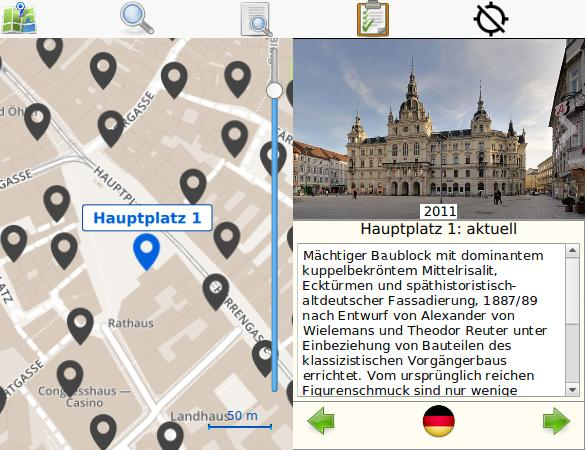

# Baugeschichte
This app is from the project "www.housetrails.org" (also known as "Baugeschichte" or "Grazwiki").

It does the communication with the server and displayes objects that are linked to coordinates
and also contain images and descriptions. It makes use of the Wikimedia API.

